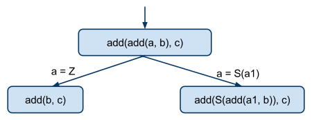
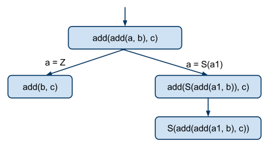
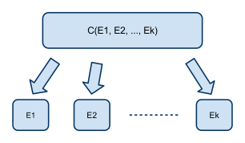
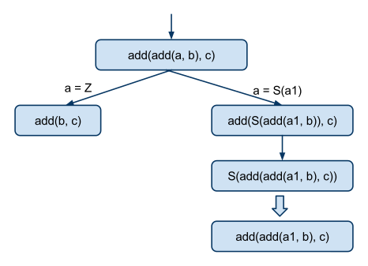
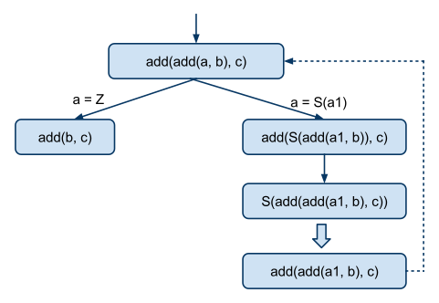
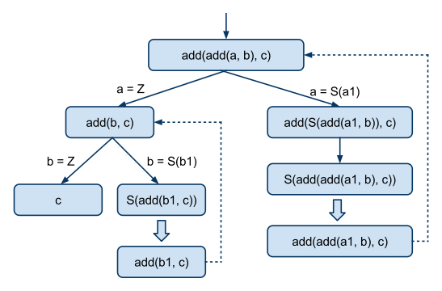

# Что такое суперкомпиляция?

**Сергей Романенко**

**3 мая 2009 г.**

Под [суперкомпиляцией][wiki-scp] обычно понимают метод анализа и преобразования
программ, основанный на следующих действиях:

* Делается попытка "выполнить" программу не для конкретных входных
  данных, а, "символически" в "общем" виде. Т.е. для произвольных
  входных данных. Ну, или, для всех входных данных, удовлетворяющих
  каким-то ограничениям. Для этого строится "дерево конфигураций" (=
  "дерево процесса"). В узлах дерева находятся "конфигурации", которые
  описывают множества состояний вычислительного процесса. Понятно, что
  эти множества должны быть описаны на каком-то языке, и могут быть не
  вполне точными ("прихватывать" что-то лишнее). А стрелки,
  связывающие узлы дерева, соответствуют каким-то действиям и
  проверкам, происходящим при исполнении программы.
* Если исходная программа содержит циклы и/или рекурсию, то дерево
  конфигураций получается, вообще говоря, бесконечное. Это нехорошо.
  Что дальше делать с бесконечным деревом? Поэтому, в процессе
  суперкомпиляции, делается попытка свернуть бесконечное дерево в
  конечный "граф конфигураций". Для этого конфигурации сравниваются
  между собой. Если появляются две похожие конфигурации, делается
  попытка "свести" ту конфигурацию, что находится в дереве ниже, к
  той, что появилась выше. В результате, в дереве появляется
  "обратная" стрелка, и дерево превращается в граф с циклами.
* Построенный конечный граф конфигураций превращается в
  "остаточную" программу. Название "остаточная" связано с тем, что не
  все части исходной программы "выпадают в осадок". Некоторые из них
  могут просто исчезать в результате суперкомпиляции (например, если
  они недостижимы при заданных ограничениях на входные данные).

Под "суперкомпилятором" обычно понимают некую систему анализа и
преобразования программ, основанную на суперкомпиляции. Другими словами,
не бывает "суперкомпиляторов", не использующих суперкомпиляцию. :-) Но
авторы суперкомпиляторов имеют полное право использовать в своих
сооружениях не только суперкомпиляцию как таковую, но и любые
дополнительные методы анализа, преобразования и оптимизации программ. (И
обычно так и поступают.)

Сам термин "суперкомпиляция", может быть, и не очень хорош в силу своей
двусмысленности. "Супер" может означать "крутой и могучий" ("супермен" =
"сверхчеловек"), а может означать "тот, кто находится сверху и
присматривает" ("супервизор" = "надсмотрщик"). Когда придумывался термин
"суперкомпилятор" имелась в виду не "могучесть", а "присмотр"...

А теперь постараемся спуститься с сияющих абстрактных вершин к чему-то
более конкретному и попытаемся разобраться, как работает
суперкомпиляция, на конкретных примерах.

Допустим, что программы, с которыми мы будем иметь дело, написаны на
простом функциональном языке (что это за язык, будет понятно из
примеров, но, при желании, описание языка можно посмотреть
[здесь][SLL].

Как известно, если в нашем распоряжении есть ноль и есть операция
прибавления единицы, функцию сложения целых неотрицательных чисел можно
определить следующим образом:

    add(0, y) = y;
    add(x+1, y) = add(x, y) + 1;

Будем считать, что неотрицательные целые числа представлены следующим
образом. Ноль - как `Z` (где `Z` - это конструктор без аргументов), а число,
следующее за числом `n` - как `S(n)` (где `S` - это унарный конструктор).
Т.е. числа

    0, 1, 2, 3,...

будут представлены как

    Z, S(Z), S(S(Z)), S(S(S(Z)))...

Теперь программа сложения приобретает вид:

    add(Z, y) = y;
    add(S(x), y) = S(add(x, y));

В таком виде, программа уже ничего не знает о свойствах чисел: она
просто механически перетасовывает `S` и `Z`.

Попробуем вычислить, например, `1+2`. С точки зрения нашей программы, это
означает, что нужно преобразовывать выражение

    add(S(Z), S(S(Z)))

до тех пор, пока из него не исчезнут все вызовы функций. А сами
преобразования должны выполняться путём применения двух правил, из
которых состоит определение функции `add`. Такие преобразования
часто называют "редукцией", а сами правила - "правилами редукции". В
данном случае получаем такую последовательность преобразований:

    add(S(Z), S(S(Z))) ⟶ S(add(Z, S(S(Z)))) ⟶ S(S(S(Z)))

При этом, какое правило когда применять, на каждом шаге определяется
однозначно.

То, что было до сих пор - это "обычное" исполнение программы. А теперь
мы переходим к "метавычислениям" (= "символическим вычислениям",
"прогонке").

А что будет, если мы попробуем отследить вычисления "в общем виде"?
Например, попытавшись "вычислить" `add(S(S(Z)), b)`, где`b` - это некая
переменная, значение которой неизвестно? А почему бы и нет? Получается:

    add(S(S(Z)), b) ⟶ S(add(S(Z), b)) ⟶ S(S(add(Z, b))) ⟶ S(S(b))

Выяснилось, что *для любого* `b`, результатом вычисления `add(S(S(Z)), b)`
является `b` к которому прибавлено `2`. Блестящий результат!
(И какой неожиданный. :-) )

Теперь наберёмся нахальства и попробуем вычислить "в общем виде"
что-нибудь более интересное. Например, `(a+b)+c`. Или, в терминах нашего
языка, изучим процесс вычисления выражения `add(add(a, b), c)`.

Здесь мы впервые сталкиваемся c вложенными вызовами функций, и возникает
вопрос: в каком порядке вычислять вызовы функций? Ответ зависит от того,
с каким языком мы имеем дело: "строгим" или "ленивым". В "строгом
языке", разрешается раскрывать вызов функции только если все её
аргументы полностью вычислены. А в "ленивом" языке, можно раскрывать
вызов функции, как только в аргументах появляется достаточно информации,
чтобы стало ясно, какое из правил применимо (не дожидаясь, пока все
аргументы полностью вычислятся). Это объяснение весьма приблизительно,
но пока что нам хватит и такого.

Итак, будем считать, что язык, с которым мы имеем дело, - "ленивый". И
рассмотрим, как будет вычисляться `((1+0)+0)`:

    add(add(S(Z), Z), Z) ⟶ add(S(add(Z, Z)), Z) ⟶ S(add(add(Z, Z), Z)) ⟶
    S(add(Z, Z)) ⟶ S(Z)

Как и следовало ожидать, в результате получилось `1`. Но в самом процессе
вычислений есть что-то не вполне удовлетворительное. А именно, при
вычислении выражения вида `add(add(a, b), c)` получается так, что `a`
обрабатывается 2 раза. Каждый раз, когда внутренний вызов `add` видит
конструктор `S`, он снимает его с `a` и выталкивает наружу.
Наружный `add` сразу же замечает это, и проталкивает `S` дальше, на верхний
уровень. Получается, что каждый `S` обрабатывается два раза. А
почему бы его не выталкивать на верхний уровень сразу?

Теперь попробуем "вычислить" выражение `add(add(a, b), c)` (содержащее
переменные!).

Пытаемся раскрыть наружный `add` - не получается, поскольку мешает внутренний 
`add`. Делать нечего, нужно "подпихнуть" внутренний `add`, чтобы он выдал наружу
какую-то информацию. Пробуем раскрыть внутренний `add`. Но и это не можем
сделать, поскольку его первый аргумент - переменная `a` (значение которой
нам неизвестно). Ну что же, тогда применим ломовой приём, отлично
известный ещё из школьного курса математики: рассуждение методом
"разбора случаев". Рассмотрим 3 взаимоисключающих случая:

* `a` имеет вид `Z`.
* `a` имеет вид `S(a1)`, где `a1` - это переменная,
  изображающая нечто, о чём мы пока ничего не знаем.
* `a` - это не `Z`, и не может быть
  представлено в виде `S(` *нечто* `)`.

Третий случай нам не интересен, поскольку в программе для него не
предусмотрено никакого правила. И попытка раскрыть вызов `add` с таким
аргументом приводит к аварийному завершению программы.

Если `a` имеет вид `Z`, то `add(add(a, b), c)` превращается в
`add(add(Z, b), c)`, и мы можем раскрыть внутренний вызов `add`,
получив `add(b, c)`. Более кратко это можно записать так:

    add(add(a, b), c) ⟶{a=Z}⟶ add(add(Z, b), c) ⟶ add(b, c)

Если `a` имеет вид `S(a1)`, мы тоже можем раскрыть внутренний вызов `add`:

    add(add(a, b), c) ⟶{a=S(a1)}⟶ add(add(S(a1), b), c) ⟶ add(S(add(a1, b)), c)

Возникает интересный вопрос: а как узнать, какие именно подстановки
следует применять к выражению? Ответ очень простой: после того, как мы
выбрали вызов функции, который хотим раскрыть, следует изучить
определение этой функции. Если определение функции содержит десять
правил, то получим и десять подстановок. Ведь мы выбираем подстановки не
как попало, а так, чтобы каждая подстановка дала возможность применить
одно из правил. (Таков ответ, правильный по существу, но приблизительный
в деталях, в которые мы пока не будем углубляться.)

Итак, мы применяем подстановку к выражению, чтобы сразу же сделать
применимым какое-нибудь правило, и сразу же это самое правило и
применяем. Подстановка однозначно определяет, какое правило оказывается
применимо, поэтому, чтобы уменьшить количество писанины, в дальнейшем мы
будем записывать такое преобразование сокращённо, в виде одного шага:

    add(add(a, b), c) ⟶{a=Z}⟶ add(b, c)

    add(add(a, b), c) ⟶{a=S(a1)}⟶ add(S(add(a1, b)), c)

Ещё более наглядно это можно изобразить в виде графа:

Теперь мы видим, что раскрытие внутреннего вызова `add` привело к тому, что 
вверх "всплыла" некоторая полезная информация в виде конструктора `S`. И теперь 
имеется достаточно информации, чтобы можно было выполнить раскрытие наружного 
вызова `add`. При этом, применимо только одно правило, т.е. разбор случаев не 
требуется.

    add(S(add(a1, b)), c) ⟶ S(add(add(a1, b), c))

В виде графа это выглядит так:

Теперь мы видим, что конструктор `S` "всплыл" на самый верх, и ничего 
интересного с ним происходить уже не будет. А нам следует сосредоточиться на 
анализе его аргумента `add(add(a1, b), c)`. Т.е. мы можем извлечь аргумент из 
конструктора, и работать дальше только с ним. Будем записывать это так:

    S(add(add(a1, b), c)) ⟹ add(add(a1, b), c)

Или, в общем случае, если некий конструктор `C` имеет `k` аргументов, как

    C(E1, E2, ..., Ek) ⟹ E1, E2, ..., Ek

А при изображении в виде графа будем поступать так: под узлом, содержащим
`C(E1, E2, ..., Ek)` будем подвешивать узлы `E1`, `E2`, ..., `Ek`:

Здесь, для наглядности, вместо обычных, мы используем широкие стрелки. (Хотя
можно было бы использовать и обычные стрелки, поскольку смысл стрелок
всегда однозначно определяется типом узла, из которого они исходят.)

Теперь граф конфигураций (= дерево процесса) принимает вид:

И тут возникает интересная ситуация! Присмотревшись к выражению
`add(add(a1, b), c)` мы видим, что оно совпадает (с точностью до переименования 
переменных) с исходным выражением `add(add(a, b), c)`! Это означает, что 
продолжать анализировать `add(add(a1, b), c)` просто глупо, поскольку ничего 
нового и интересного мы не получим. Всё, что можно было узнать, мы уже узнали 
при анализе выражения `add(add(a, b), c)`. Поэтому, мы добавляем к графу 
"обратную" пунктирную стрелку от `add(add(a1, b), c)` к `add(add(a, b), c)` и 
оставляем `add(add(a1, b), c)` в покое.

Теперь нужно заняться выражением `add(b, c)`. Здесь требуется разобрать два случая:

    add(b, c) ⟶{b=Z}⟶ c

    add(b, c) ⟶{b=S(b1)}⟶ S(add(b1, c))

Извлекаем `add(b1, c)` из `S(add(b1, c))`

    S(add(b1, c)) ⟹ add(b1, c)

После чего видим, что `add(b1, c)` совпадает, с точностью до переименования 
переменных, с `add(b, c)`. Получается граф

Этот граф изображает все возможные пути вычисления выражения `add(add(a, b), c)` 
для любых `a`, `b` и `c`.

Интересно, что случаи аварийного завершения вычисления тоже отражены в
графе, хотя и неявно. Просто, если в аргументе вызова функции появляется
некий конструктор, для которого в графе нет стрелки, считается, что
вычисление завершается аварийно.

Ну, а если граф содержит *полную* информацию о возможных путях
вычисления, это означает, что эту информацию можно превратить в
*программу*. Эта программа и будет окончательным результатом работы
суперкомпилятора!

Способ генерации программы из графа конфигураций (дерева процесса)
довольно прямолинеен.

Каждый узел в графе можно превратить в функцию. Для этого, пометим каждый узел в 
графе неким идентификатором, который будет служить именем функции. Посмотрим, 
какие переменные появляются в конфигурации. Эти переменные и будут аргументами 
функции. Например, если для узла придумано имя `g1` и в узле написано
`add(add(a, b), c)`, то этому узлу будет соответствовать функция `g1(a, b, c)`.

Теперь надо посмотреть, какие стрелки выходят из узла. Допустим, выходят
стрелки, соответствующие проверкам. Например:

    add(add(a, b), c) ⟶{a=Z}⟶ add(b, c)

    add(add(a, b), c) ⟶{a=S(a1)}⟶ add(S(add(a1, b)), c)

Тогда для каждой из стрелок генерируется правило, выполняющее проверку

    g1(Z, b, c) = ...

    g1(S(a1), b, c) = ...

Теперь нужно сгенерировать правые части правил. Для этого надо посмотреть, что 
находится в тех узлах, на которые направлены стрелки. В случае правила с левой 
частью `g1(S(a1), b, c)` стрелка идёт в узел, в котором находится выражение 
`add(S(add(a1, b)), c)`. Допустим, этому узлу присвоено имя `f1`. Тогда ему 
соответствует функция `f1(a1, b, c)`. Ну, так эту функцию и нужно вызвать в 
правой части правила:

    g1(S(a1), b, c) = f1(a1, b, c)

Теперь займёмся узлом `f1`. Из него выходит только одна стрелка:

    add(S(add(a1, b)), c) ⟶ S(add(add(a1, b), c))

и на этой стрелке нет проверки условий. Отлично! Значит, нужно просто вызвать 
функцию, соответствующую узлу `S(add(add(a1, b), c))`. Допустим, ему присвоено 
имя `f2`. Стало быть, ему соответствует функция `f2(a1, b, c)`. Получается 
правило:

    f1(a1, b, c) = f2(a1, b, c)

Понятно, что, на самом деле, функция `f1` - лишняя, поскольку из `g1` можно было 
бы вызвать `f2` напрямую, минуя `f1`. Но это уже - оптимизация. А нам сейчас 
важно разобраться, с генерацией программы из графа, так сказать, на идейном 
уровне.

Теперь надо рассмотреть узел, в котором написано `S(add(add(a1, b), c))`. Ему, 
как упоминалось выше, соответствует функция `f2(a1, b, c)`. А стрелка, выходящая 
из этого узла идёт в узел, в котором находится `add(add(a1, b), c)`, и означает, 
что нужно вычислить `add(add(a1, b), c)`, а на то, что получится, надеть 
конструктор `S`. Пусть узлу `add(add(a1, b), c)` присвоено имя `f3` и 
соответствует функция `f3(a1, b, c)`. Тогда всему вышесказанному соответствует 
правило:

    f2(a1, b, c) = S(f3(a1, b, c))

И теперь мы можем, наконец, рассмотреть узел `add(add(a1, b), c)`, которому, как 
сказано выше, соответствует функция `f3(a1, b, c)`. Из этого узла идёт обратная 
стрелка в узел `add(add(a, b), c)`, соответствующий функции `g1(a, b, c)`. Очень 
хорошо! Это можно изобразить в виде правила:

    f3(a1, b, c) = g1(a1, b, c)

Как узнать, каким способом следует сформировать аргументы в вызове функции `g1`? 
Очень просто! Нужно просто наложить друг на друга два выражения

    add(add(a, b), c)

    add(add(a1, b), c)

и убрать совпадающие части. Вот и получатся два списка переменных:

    a, b, c

    a1, b, c

из которого и видно, какие переменные каким соответствуют.

Продолжая в том же духе (и удаляя лишние промежуточные функции),
получаем остаточную программу:

    start(a, b, c) = g1(a, b, c);
    g1(Z, a, b) = g2(a, b);
    g1(S(a), b, c) = S(g1(a, b, c));
    g2(S(a), b) = S(g2(a, b));
    g2(Z, a) = a;

Ну, а теперь можно посмотреть, что делает с рассмотренной программой
реальный суперкомпилятор spsc: [AddAdd][].

Если у вас есть аккаунт в Гугле, можете сделать Sign In и тогда
появляется возможность заводить свои собственные задания для spsc через
веб-интерфейс.

---

[Оригинал послания и комментарии](http://metacomputation-ru.blogspot.com/2009/05/blog-post.html) 

[wiki-scp]: http://ru.wikipedia.org/wiki/%D0%A1%D1%83%D0%BF%D0%B5%D1%80%D0%BA%D0%BE%D0%BC%D0%BF%D0%B8%D0%BB%D1%8F%D1%86%D0%B8%D1%8F

[SLL]: https://sergei-romanenko.github.io/spsc/SimpleLazyFirstOrderLanguage

[AddAdd]: http://spsc.appspot.com/view?key=agpzfnNwc2MtaHJkcjQLEgZBdXRob3IiGnNlcmdlaS5yb21hbmVua29AZ21haWwuY29tDAsSB1Byb2dyYW0YmhEM
