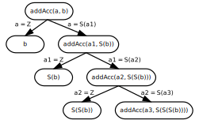
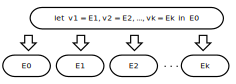
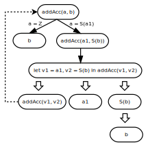

# Обобщение конфигураций при суперкомпиляции

**Сергей Романенко**

**6 мая 2009 г.**

В заметке ["Что такое суперкомпиляция?"][wiscp] разбирался пример,
в котором всё получалось хорошо и гладко. Как легко
догадаться, это свидетельствует вовсе не о том, что суперкомпиляция
способна колоть как орехи любые проблемы, а о том, что пример был
тщательно выбран.

Поэтому, чтобы компенсировать допущенную "нечестность" и
"необъективность", давайте разберём пример, в котором суперкомпиляция
сталкивается с некоторыми проблемами. Некоторые из этих проблем решаются
с помощью "обобщения" конфигураций. Но "обобщение" тут же создаёт новые
проблемы: когда его делать, а когда не делать. И какие конфигурации
следует обобщать до каких?

Итак, рассмотрим такую забавную функцию:

    addAcc(0, n) = n;
    addAcc(m+1, n) = addAcc(m, n+1);

Эта функция выдаёт результат сложения двух её аргументов. Но, в отличие
от функции `add`, рассмотренной в ["Что такое суперкомпиляция?"][wiscp],
она долго трудится, ничего не выдавая наружу: перекладывает единички из
первого аргумента во второй, а потом сразу выдаёт готовый результат. А
функция `add` выдавала результат своей работы частями.

Если перейти к представлению натуральных чисел конструкторами `Z` и `S`, 
определение функции `addAcc` принимает вид:

    addAcc(Z, y) = y;
    addAcc(S(x), y) = addAcc(x, S(y));

Теперь попробуем просуперкомпилировать `addAcc(a, b)`. Получается такое
дерево процесса:

Видно, что это дерево - бесконечно, поскольку всё время получаются
конфигурации, не совпадающие с предыдущими:

    addAcc(a, b)
    addAcc(a1, S(b))
    addAcc(a2, S(S(b)))
    addAcc(a3, S(S(S(b))))
    ...

Если и дальше продолжать в таком же духе, то процесс построения дерева
никогда не закончится!

С другой стороны, хотя конфигурации и не совпадают, между ними всё же
есть и нечто общее. А именно, каждая из конфигураций в
последовательности является "частным случаем" предыдущей конфигурации
(кроме, разумеется, самой первой из них).

Сейчас постараемся разобраться более точно, что именно означают слова
"частный случай".

Начнём с уточнения терминологии. Выражения общего вида, которые могут
(но не обязаны) содержать конструкторы, вызовы функций и переменные, мы
будем называть "конфигурациями". А выражения, которые могут содержать
только конструкторы и вызовы функций (т.е. не содержат переменных), мы
будет называть "рабочими выражениями". Таким образом, рабочие выражения - это 
вырожденные конфигурации, не содержащие переменных.

Можно считать, что каждое рабочее выражение изображает некоторое
"конкретное" состояние вычислительного процесса. А каждая конфигурация,
может рассматриваться как изображение некоторого множества рабочих
выражений, или, другими словами, возможных состояний вычислительного
процесса. А именно, берём конфигурацию, подставляем вместо её переменных
всевозможные рабочие выражения, и получаем разные рабочие выражения из
множества, изображаемого конфигурацией.

А если конфигурация не содержит переменных - то считаем, что она
изображает множество из одного элемента: рабочего выражения,
совпадающего с самой конфигурацией.

Можно подойти к делу и с другого конца. Допустим, у нас есть некая конфигурация 
`X` и некое рабочее выражение `A`. Можно ли проверить, принадлежит ли `A` к 
множеству, изображаемому `X`? Или, другими словами, можно ли переменные в `X` 
заменить на такие рабочие выражения, что `X` после этого совпадёт с `A`? Поиск 
таких значений переменных часто называют "сопоставлением `A` с образцом `X`".

Найти подходящие значения переменных (если таковые существуют) можно наложив `A` 
и `X` друг на друга. Например: сопоставим `addAcc(S(Z), S(Z))` с `addAcc(a1, 
S(b))`. Удалим те части двух выражений, которые попарно совпадают, и сразу 
становится видно, что `S(Z)` накладывается на `a1`, а `Z` на `b`. Или, выражаясь 
более формально,

    A = X {a1 := S(Z), b := Z}

где `X {a1 := S(Z), b := Z}` - это результат применения к `X` подстановки `{a1 
:= S(Z), b := Z}`. Впрочем, для подстановок часто применяют и другие 
обозначения, например, такое: `[S(Z)/a1, Z/b]`. Как
говорится, "на вкус и цвет товарищей нет"...

Теперь рассмотрим две конфигурации `X1` и `X2`. Предположим, что конфигурацию 
`X1` можно превратить в конфигурацию `X2`, заменив переменные, входящие в `X1`, 
на некоторые выражения (которые могут содержать переменные). Или, говоря 
формально,

    X1 S = X2

где `S` - некоторая подстановка. В этом случае будем говорить, что `X2` является 
"частным случаем" `X1`, и будем записывать это как `X1 <= X2`. Знак `<=` (меньше 
или равно) здесь используется из-за того, что `X1` не может быть "толще", чем 
`X2`. Ведь переменные в `X1` заменяются либо на переменные, либо на что-то более 
"массивное". Например,

    addAcc(a1, S(b)) <= addAcc(a2, S(S(b)))

поскольку

    addAcc(a1, S(b)) {a1 := a2, b := S(b)} <= addAcc(a2, S(S(b)))

Можно доказать такую теорему: если `X1 <= X2`, то множество рабочих выражений, 
изображаемых `X2`, полностью покрывается множеством рабочих выражений, 
изображаемых `X1`. В этом смысле, `X2` и является "частным случаем" `X1`: `X1` 
"накрывает" `X2`.

А теперь мы можем вернуться к графу конфигураций, который рассматривали
в начале. Теперь мы видим, что при построении дерева у нас получилась
последовательность конфигураций

    addAcc(a, b) <= addAcc(a1, S(b)) <= addAcc(a2, S(S(b))) <= ...

в которой каждая последующая является частным случаем предыдущей.

Поэтому, возникает такая идея: если в процессе суперкомпиляции нам сначала 
попадается конфигурация `X1`, а затем - конфигурация `X2`, которая является 
частным случаем `X1`, то зачем изучать дальнейшее течение вычислительного 
процесса для `X2`? Всё, что включено в `X2`, входит и в `X1`, а все пути 
вычислений, выходящие из `X1` мы и так изучим. Поэтому, не лучше ли как-то 
привести `X2` к такому виду, чтобы она совпала с `X1` (c точностью до имён 
переменных) и провести в графе "обратную" стрелку от `X2` к `X1`?

Сведение `X2` к "более общей" конфигурации `X1` в процессе суперкомпиляции и 
называется "обобщением `X2` до `X1`". А именно, заменяем `X2` на конструкцию

    let v1 = E1, ... , vk = Ek in E0

где `E0 {v1 = E1, ... , vk = Ek} = X2`, а `E0` совпадает с `X1` с точностью до 
переименования переменых. При этом, в качестве `v1`, ... , `vk` выбираются такие 
переменные, которые нигде больше не используются в дереве процесса (чтобы 
случайно не возникло путаницы с другими переменными).

Выглядит всё это устрашающе, но суть дела проста. Поскольку `X1 <= X2`, то 
просто накладываем `X1` на `X2` и смотрим, какие куски из `X2` наложатся на 
переменные из `X1`. Если `X1` содержит `k` переменных, то эти переменные 
наложатся на какие-то подвыражения `E1`, ..., `Ek` из `X2`. Придумаем для них 
свежие уникльные имена `v1`, ..., `vk`. После этого, извлекаем `E1`, ..., `Ek` 
из `X2` и заменяем их на `v1`, ..., `vk` соответственно. Результат всех этих 
действий изображаем в виде let-выражения

    let v1 = E1, ... , vk = Ek in E0

Например, сопоставляем `addAcc(a, b)` и `addAcc(a1, S(b))` и видим, что

    addAcc(a, b) { a := a1, b := S(b)} = addAcc(a1, S(b))

Отлично! Значит, `E1` и `E2` - это `a1` и `S(b)`. Придумываем для них имена `v1` 
и `v2`. После чего переписываем `addAcc(a1, S(b))` в виде

    let v1 = a1, v2 = S(b) in addAcc(v1, v2)

теперь мы видим, что `addAcc(v1, v2)` совпадает с `add(a, b)` с точностью до 
переименования переменных. Но, чтобы можно было добавить к графу конфигураций 
обратную стрелку, нужно совершить ещё одно действие: развалить let-узел на 
части, чтобы выражение `addAcc(v1, v2)` оказалось в отдельном узле, который мы и 
соединим с узлом, в котором находится `addAcc(a, b)`.

Растаскивание let-узла на части мы будет изображать следующим образом:

Это очень похоже на растаскивание на части узла, содержащего конструктор
на верхнем уровне. И, как и в том случае, порядок, в котором расположены
стрелки, - существен.

Теперь мы можем, в качестве результата суперкомпиляции `addAcc(a, b)`, построить 
следующий конечный граф конфигураций:

Можно посмотреть, как справляется с этим примером суперкомпилятор [SPSC][]:
[addAcc(a, b)][] и [addAcc(a, Z)][].

Если из этого графа построить остаточную программу, то оказывается, что
она совпадает с исходной программой. Таков, прямо скажем, жалкий
результат всех наших мучений и титанических усилий... :-)

Ну что же... Это говорит только о том, что возможности "чистой
суперкомпиляции" ограничены. С чем-то она справляется, а с чем-то - нет.
А, как уже было сказано, в суперкомпиляторах разрешается использовать не
только суперкомпиляцию как таковую, но и любые дополнительные методы,
увеличивающие способности суперкомпилятора.

---

[Оригинал послания и комментарии](http://metacomputation-ru.blogspot.com/2009/05/meta-ru-generalization.html)

[wiscp]: 01-what-is-scp.md

[SPSC]: https://sergei-romanenko.github.io/spsc/

[addAcc(a, b)]: http://spsc.appspot.com/view?key=agpzfnNwc2MtaHJkcjQLEgZBdXRob3IiGnNlcmdlaS5yb21hbmVua29AZ21haWwuY29tDAsSB1Byb2dyYW0YgRkM

[addAcc(a, Z)]: http://spsc.appspot.com/view?key=agpzfnNwc2MtaHJkcjQLEgZBdXRob3IiGnNlcmdlaS5yb21hbmVua29AZ21haWwuY29tDAsSB1Byb2dyYW0YmxEM
